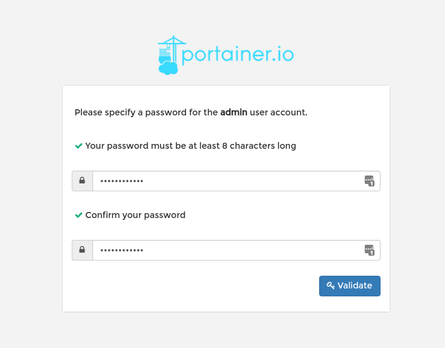
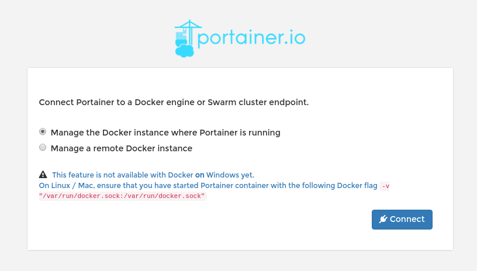
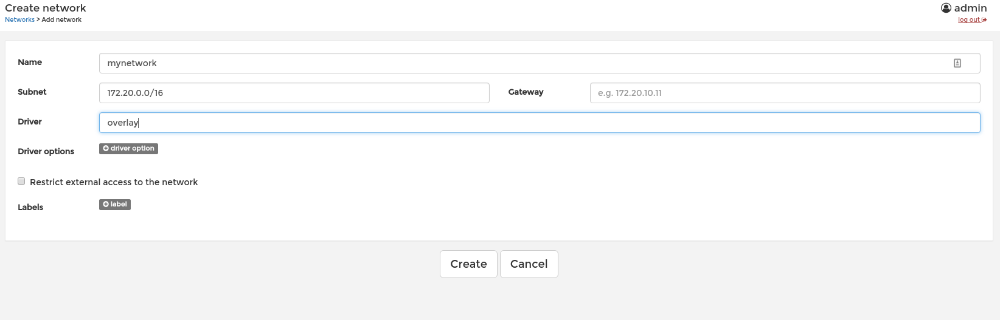
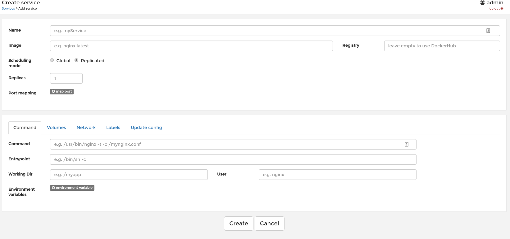

@(learning docker)[docker]

#Docker Swarm

[TOC]
## 初始化

```bash
$ docker swarm init --listen-addr <MANAGER-IP>:<PORT>
```
> **提示：**如果不加--listen-addr 使用默认ip端口（2377）

## 加入集群

```bash
$ docker swarm join <MANAGER-IP>:<PORT>
```

## 安装portainer
portainer是docker swarm web 管理工具，可以图形化管理swarm，使用简单，强烈推荐安装。如果在portainer在swarm管理节点安装，添加启动参数：-v /var/run/docker.sock:/var/run/docker.sock

**官方文档**：[https://portainer.readthedocs.io/en/stable/](https://portainer.readthedocs.io/en/stable/)

```bash
$ docker run -d --name portainer -p 9000:9000 -v /var/run/docker.sock:/var/run/docker.sock portainer/portainer
```

## 设置管理员账号密码


## 连接swarm


## 仪表盘


## overlay网络


## 管理service 


